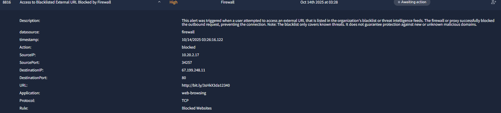

# Incident Report 001 – Black  Listed External URL blocked by Firewall

# Incident Report – Alert 8816

## Time of Activity
2025-10-14 02:26:16 AEST

## List of Affected Entities
- Source IP: 10.20.2.17
- Destination IP: 67.199.248.11
- Destination Port: 80
- Application: web-browsing
- Protocol: TCP
- URL: http://bit.ly/3sHkX3da12340

## Reason for Classifying as True Positive
- URL matched threat intelligence feeds and firewall blacklist.
- Splunk logs confirmed outbound request.
- Sandbox analysis returned 404, indicating prior malicious use.
- User behavior suggests phishing exposure.

## Reason for Escalating the Alert
- User clicked a shortened malicious link during business-related research.
- Potential phishing compromise and social engineering risk.
- Endpoint integrity and lateral movement need assessment.

## Recommended Remediation Actions
- Notify user and review endpoint.
- Block destination IP across perimeter.
- Add URL to internal threat feeds.
- Conduct phishing awareness training.
- Monitor for similar outbound attempts.

## Screenshots

### 🔔 Alert Summary

*Figure 1: Firewall alert showing blocked access to blacklisted external URL (104.26.15.222).*

### 🧪 ANY.RUN Sandbox Analysis 

*Figure 2: ANY.RUN sandbox result showing Bitly URL returns 404 error. Confirms link is inactive but previously flagged as malicious.*

### 📊 Splunk Event Log – Firewall Alert

*Figure 3: Splunk dashboard showing blocked outbound request to blacklisted Bitly URL. Includes destination IP, action, and protocol.*

### 📊 Splunk Event Log – User Activity 

*Figure 4: Splunk search results showing blocked metadata events from Stream logs, including destination IPs, URIs, and application details.*

### 📧 > ⚠️ Endpoint screenshots (browser history, email client, task manager, downloads folder) could not be captured due to persistent VM instability. Findings are based on SIEM logs, sandbox analysis, and firewall alerts.

